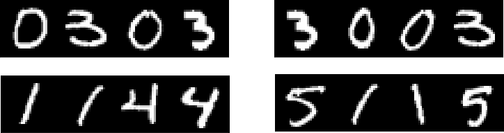
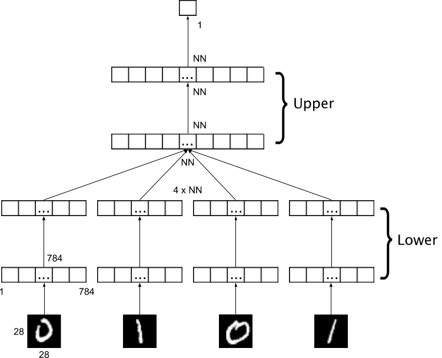
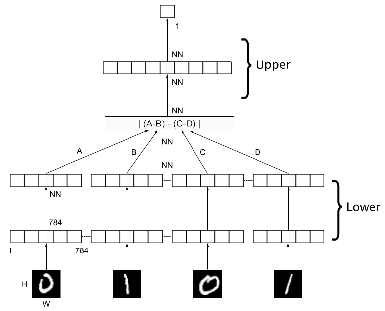
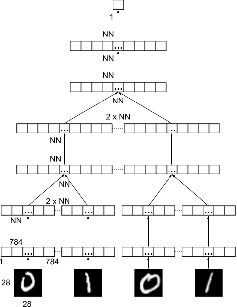
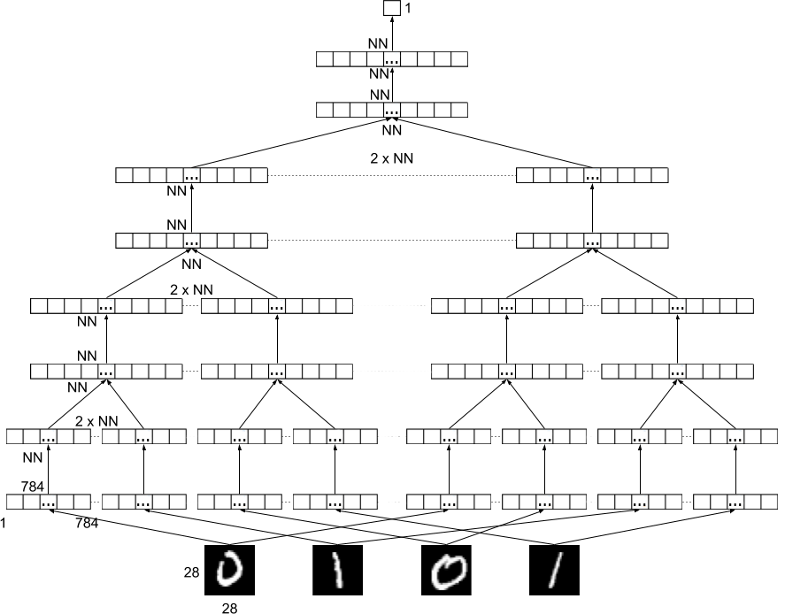
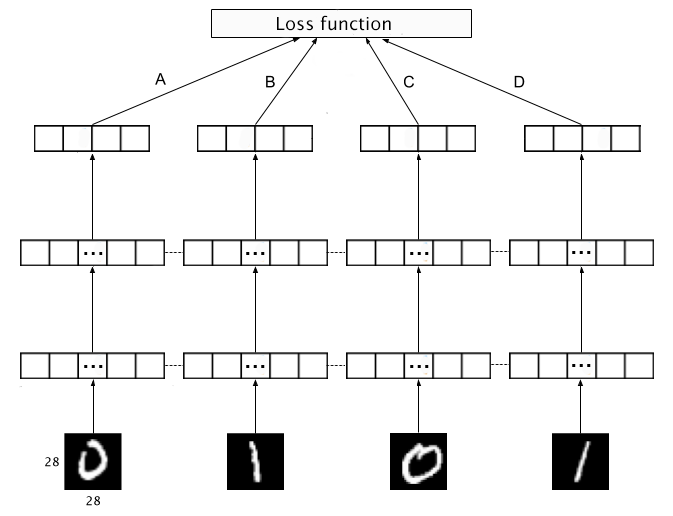

# Analogical potential:  learning fromthe differences between differences

PEERAPAN LAORCHAIRANGSI's research

## Abstract

AbstractWe address the problem of learning to group and distinguishingbetween classes of objects by recognising the commonalities andthe differences between them.  Analogy is a relation between fourobjects where the first object is to the second object as the thirdobject  is  to  the  fourth  object.   The  relation  can  be  defined  bythe  labels  of  the  objects.   We  propose  a  method  to  indirectlylearn how to classify using analogy, for the ultimate purpose ofobject classification.  Two facts are put in use:  firstly, there areeight equivalent forms of a same analogy; secondly, any quadrupleof  objects  is  an  analogy  or  not.   This  produces  a  large  numberof  positive  and  negative  examples  of  analogies  from  any  set  oflabelled  objects.   Interestingly,  the  labels  are  forgotten  in  theanalogies.  This changes the task from multi-class classification tobinary classification.We show how to recognise analogies between images, that is thequadruples of images for which an analogy holds between theirlabels.  We design and propose a neural network model to per-form the task of recognising analogies produced by this method.The use of a so-called analogical potential into a relatively simpleneural network architecture leads easily to high accuracy for therecognition of analogies.  We show that the proposed analogicalpotential allows our network to learn embeddings which separateclasses better and distribute objects more evenly among classes,without explicit knowledge of the class labels.



# Table of Contents
* Documentation
* Requirements
* Quickstart
* Acknowledgements

## Documentation

## Requirements

Install the required packages by using `pip` with `requirements.txt`:

```
pip install -r requirements.txt
```

If you want to install to the jetson nano, please use the `requirements_jetson.txt` instead.

```
pip install -r requirements_jetson.txt
```

## Quickstart

### Virtual Environment

We provide the script to create the virtual environment which installs all necessaries resource for our project.

```
create_venv.sh
```

Or this script below for jetson nano.

```
create_venv_jetson.sh
```

### Jupyter notebook

We prepare the jupyter notebook version of our project. You can run these notebooks.

```
1_preprocessing.ipynb
2_toy_training.ipynb
```

These will give you the idea of how to set up the dataset and how our model works.

### Train model

```
python3 train_model.py
```

This is the main script of our system. They are plenty of options that you can customize. This is the quick guideline for the options that we mostly used.

```
--load-model your_model # to load the model
--custom-name your_save_output_name # give the every output name that this model produces

--fix-dataset --train-file dataset/mnist-train-%d.csv
# to set the dataset to fixed dataset this will load the dataset with counter
# start from 1 like: mnist-train-1.csv ...
--train-file dataset/mnist-train-3000.csv
# to set the dataset to the pool of images then it will randomly pick and objects
# and generate the analogy for you

--test-file dataset/mnist-test.csv # set the test set
--dev-file dataset/mnist-dev.csv # set the development set

--using-old-model # change the model to hierarchical model
--using-analogy-fn #  apply an analogical potential to the model
--using-shared-weight # apply shared weight to the model
--using-contrastive-loss
# change the model to contrastive loss model and enable 
# you to select other function for multi-task learning

--export-embedding # save the embedding to the folder embedding
# set the embedding train and test files
```

For the other options, you can use the command --help to see more details.

## Evaluate model

After we run the model, we can export an embedding of the model. The scripts below are used to evaluate a multi-class classification score for an embedding.

```
python3 evaluate_classification.py \
    --data mnist-test-embedding.txt --ref-data mnist-train-embedding.txt \
    --label mnist-test-label.txt --ref-label mnist-train-label.txt
```

This script requires embedding file and label file for both train (ref-data/ref-label) and test (data/label). It will give you the precision/recall/f1-score, and you can choose other options like knn, simple multilayer perceptron (--help for see those options).

```
python3 evaluate_classification.py \
    --data mnist-test-embedding.txt --ref-data mnist-train-embedding.txt \
    --label mnist-test-label.txt --ref-label mnist-train-label.txt
```

or

```
python3 evaluate_classification.py --input mnist
```

This script requires embedding file and label file for the embedding that you want to check. It will create the PCA and t-SNE figures as the outputs.

```
python3 evaluate_embedding.py \
    --data mnist-test-embedding.txt --label mnist-test-label.txt
```

or

```
python3 evaluate_embedding.py \
    --input mnist-test
```

### Re-produce the experiment results

I collect the commands to re-produce the experiments and explanations.
They are in folder `script`.

### Support other format of the objects

You can look at the notebook `3_text_training.ipynb`
For how to change my code to support the other types of the object.

In this example, I show how to work with pure text and create the simple constructor to convert the text to tensor variable.

### Frequently Asked Questions

* What is a image pool?

We can not use all the analogies from the original dataset.
There are too much.
So we decide to randomly select the object from each class and create an analogy from that chosen objects.
We can say that the pool is the array of the object that we can choose for each class.
Currently, they are limited to equally size for every class.

* What are the models?

We have plenty of architectures that you can use for train your own model.

1. Fully connected model + embeddings

This is the default architecture of our project.
You can set `--input-layer` for the embedding part like:

```
--input-layer 128,128 # For 2 layer 128 neurons for each layer.
```

Or

```
--input-layer '' # For do not have any layer.
```

`--first-layer` for decision part.



2. You can add more options like `--using-shared-weight`

Just like (1) but each embedding will share the weight  


Or `--using-analogy-fn` for adding analogical potential layer.



3. For others,

Hierachical structure (`--using-old-model`)
(The layers are following: input-layer, first-layer, and second-layer)



The exchange of the means (`--using-exchange-mean`)
Using thrid-layer for custom the last layer.



Contrastive loss (`--using-contrastive-loss`)



## Acknowledgements

I would like to express my gratitude to all those who helped me during the writing of this thesis :)
